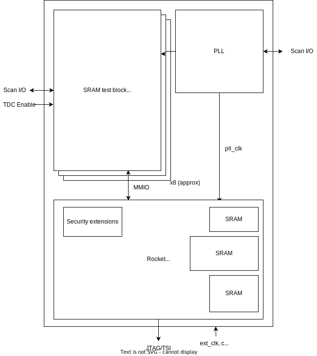
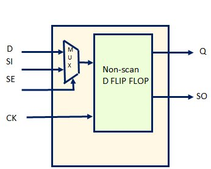

# STAC: SRAM Timing Analysis Chip

High-level information:
* Submitting to Efabless ChipIgnite 2306Q
* Tapeout deadline: June 5, 2023
* Chips (supposedly) delivered: October 27, 2023
* Package: QFN, 64 pins
* [I/O map](https://docs.google.com/spreadsheets/d/1pwuNWhKo4AzVCC_3EHxcBpiF1-V-zbCteOw8ayxvDU0/edit#gid=2022539742) (WIP)
* [Top level repo](https://github.com/ucb-bar/stac-top)

# Organization

A rough top-level diagram of the chip is shown below:



Each SRAM test block contains the following elements:


Update: Rather than having one BIST block per SRAM, there will instead
be one BIST pattern generator shared across all SRAMs.

To the extent possible, the top level will be generated
by Chipyard/Hammer.

## Rocket

* A TinyRocket instance generated by Chipyard
* Has an option to allow all internal SRAMs to by bypassed
* Communicates with the SRAM test blocks via memory-mapped I/O

The Rocket communicates with the SRAM test blocks via MMIO only.
The test blocks do not participate in the memory hierarchy of the core.

## SRAM Test Blocks

The SRAM test area uses the following pins:
* `clk`: The global clock.
* `SRAM_RSTB`:  An active-low reset for all SRAM test circuitry, including the scan chain.
* `SRAM_SCAN_IN`: SRAM scan chain input.
* `SRAM_SCAN_OUT`: SRAM scan chain output.
* `SRAM_SCAN_EN`: Enables scan chain mode.
* `SRAM_SAE_CLK`: The clock used to drive the SRAM sense amplifiers.
* `SRAM_TEST_EN`: Enables **manual test mode (MTM)** for all SRAMs.
* `TDC_EN`: When in MTM, enables all TDCs. When low, TDCs holds their values.
  Ignored outside of MTM.
* `SRAM_EN`: A global chip enable for all SRAM blocks. When setting up SRAM inputs (via scan chain or MMIO), should be held low; once the inputs are ready and stable, this should be set high (usually for one cycle).
* `BIST_EN`: Enables all BIST modules when in test mode.

There are three modes of test operation:
* Built-in self-test (BIST). Performs at-speed (1 op per cycle) testing of predefined memory patterns.
* Rocket-controlled testing over memory-mapped I/O (MMIO).
  Programmable test pattern, but limited speed due to needing to fetch instructions from memory
  and synchronize TDC output. Roughly 5-10 cycles per operation.
* Manual test mode (MTM). Enables testing via scan chain.
  Can scan inputs into registers, then scan out SRAM output.
  Slow (~1k cycles per op), but does not rely on Rocket or BIST working.

Note that there are no dual-clock scan chain FFs in the open-source SKY130 PDK.
(Dual-clock FFs have a scan clock port and an independent system clock port.)

Alongside the global BIST, there will be a shared MMIO controller.
The MMIO controller enables the Rocket to read/write to the SRAMs directly,
without the need for programming a pattern into the BIST.
The MMIO controller is described in more detail below.

```verilog
// Global SRAM input select
assign sram_sel = omitted; // register connected to MMIO and the scan chain.
assign sram_sel_next = SRAM_TEST_EN ? sram_sel : mmio_controller_sram_sel_next;

// Signals for the i'th SRAM block
assign sram_en_i = SRAM_TEST_EN ? SRAM_EN : chip_sram_en_i;

// `tdc_en_i` is an input to the TDC clock gating cell described in the TDC config section
assign tdc_en_i = SRAM_TEST_EN ? TDC_EN : mmio_controller_tdc_en;

always @(*) begin
  case (sram_sel)
    SRAM_SEL_BIST : addr_i = bist_addr;
    SRAM_SEL_SCAN: addr_i = scan_addr_i;
    SRAM_SEL_MMIO: addr_i = mmio_controller_addr;
    SRAM_SEL_DISABLE: addr_i = 0;
    default: addr_i = 0;
  endcase

  case (sram_sel)
    SRAM_SEL_BIST : chip_sram_en_i = bist_en && bist_sram == i;
    SRAM_SEL_SCAN: chip_sram_en_i = 0;
    SRAM_SEL_MMIO: chip_sram_en_i = mmio_controller_en_i;
    SRAM_SEL_DISABLE: chip_sram_en_i = 0;
    default: chip_sram_en_i = 0;
  endcase
end
```

Clock should be held low when not in use.

### Memory Faults

BIST patterns are meant to identify common classes of faults:
* Stuck-at faults (SAFs): A cell's value is always 0 or 1; it cannot be changed.
  A test that reads a 0 and a 1 from every cell detects all SAFs.
* Stuck-open faults (SOpFs): A cell cannot be accessed (eg. due to an open wordline).
  Attempting to read a cell with a SOpF results in either a 0 or 1, depending on
  the offset voltage of the sense amplifier in that cell's column. The read value
  is, to first order, independent of the value in the cell.
  It is also repeatable: if one read of a SOpF cell produces a 0, subsequent reads
  should also produce a 0.
* Transition faults (TFs): A cell cannot be set to 0, cannot be set to 1, or both.
  To detect all TFs, a test must transition each cell from 0 to 1
  and from 1 to 0, and the correct cell value must be read after each transition.
  (Note that writing a 1 is not exactly the same as causing a transition to 1. A transition
  to 1 only occurs when the cell stores a 0 and is written with a 1.)
* Data retention faults (DRFs): A cell loses its value after some amount of time.
  These faults can be caused by faulty pull-up transistors.
* Coupling faults (CFs): Transitions or patterns in aggressor cells cause a fault in a victim cell.
  There are a few types of CFs:
  * Inversion coupling faults (CFins): A transition in an aggressor cell flips the contents of the victim cell.
    A test to detect all CFins must read each victim cell after performing an odd number of transitions
    on potential aggressor cells.
  * Idempotent coupling faults (CFids): A transition in an aggressor cell sets the contents of the victim cell to 0 or 1.
    A test to detect all CFids must read each victim cell after performing transitions on potential aggressor cells.
    The potential CFids triggered should not mask each other.
  * State coupling faults (CFsts): The values in one or more aggressor cells force a victim cell to a certain value.
* Address decoder faults (AFs):
  * An address does not access any cells
  * A cell is not accessed by any address
  * A single address accesses multiple cells
  * A cell can be accessed by multiple addresses

A few BIST patterns are described below.

#### MATS+

Pattern:

| Element | Operations | Address direction |
| --- | --- | --- |
| 1 | w0 | up/down |
| 2 | r0, w1 | up |
| 3 | r1, w0 | down |

Test length: `5n`

Faults detected: All SAFs and AFs.

#### March C-

Pattern:

| Element | Operations | Address direction |
| --- | --- | --- |
| 1 | w0 | up/down |
| 2 | r0, w1 | up |
| 3 | r1, w0 | up |
| 4 | r0, w1 | down |
| 5 | r1, w0 | down |
| 6 | r0 | up/down |

Test length: `10n`

Faults detected: Unlinked CFids, AFs, SAFs, CFsts, TFs, CFins not linked with CFids.

#### March A

Pattern:

| Element | Operations | Address direction |
| --- | --- | --- |
| 1 | w0 | up/down |
| 2 | r0, w1, w0, w1 | up |
| 3 | r1, w0, w1 | up |
| 4 | r1, w0, w1, w0 | down |
| 5 | r0, w1, w0 | down |

Test length: `15n`

Faults detected: Linked CFids, AFs, SAFs, TFs not linked with CFids, some CFins linked with CFids.

#### March B

Pattern:

| Element | Operations | Address direction |
| --- | --- | --- |
| 1 | w0 | up/down |
| 2 | r0, w1, r1, w0, r0, w1 | up |
| 3 | r1, w0, w1 | up |
| 4 | r1, w0, w1, w0 | down |
| 5 | r0, w1, w0 | down |

Test length: `17n`

Faults detected: All faults detected by March A, as well as TFs linked with CFins or CFids.


### Programmable BIST

The goal of the programmable BIST engine is to enable at-speed (1 cycle per op) testing for patterns
that we anticipate will expose faults. It only supports common memory test patterns. For fully
general pattern generation, the Rocket should be used.

There will be one programmable BIST engine shared across all SRAM test macros.

The BIST requires the following run-time configuration:
* `MAX_ROW_ADDR`: The maximum row address (inclusive).
* `MAX_COL_ADDR`: The maximum col address (inclusive).
* `INNER_DIM`: Set to `ROWS` or `COLS`; determines whether row or column addresses, respectively,
  are in the inner loop of all march sequences.

The BIST also stores (in flip flops) a data background pattern table (DBPT).
This table can be programmed by the scan chain or by the Rocket.
Although the table is shown for 4 bit data, the true data size is
determined by the maximum SRAM width being tested.

| Address | Data |
| --- | --- |
| 0 | 0000 |
| 1 | 1111 |
| 2 | 0101 |
| 3 | 1010 |
| 4 | 0101 |
| 5 | 0011 |
| 6 | 1100 |

The BIST supports the following instructions:
* `RESET seed`: Resets signature registers and seeds the pseudo-random number generator.
* `WAIT n`: Waits for `N` clock cycles.
* `MARCH e0 [, e1, ...] { UP | DOWN }`: marches up or down the address space,
  performing the march operations `e0`, `e1`, ...
  The possible march operations are `{READ | WRITE} pattern_address [ FLIP ]`.
  For example, the march operation `READ 5 FLIP` checks that each read operation returns the bit
  sequence `1100`, which is the bitwise complement of pattern 5 in the table above.
* `RAND re0 [, re1, ...] { RA N | UP | DOWN }`: Runs a pseudo-random test.
  If `UP` or `DOWN` is specified, marches up or down (respectively) the address space,
  performing the random elements `RE0`, `RE1`, ...
  If `RA` is specified, a pseudo-random address is used. The integer `N` specifies how many
  addresses to pick. For example, `RAND OP WRITE 0, READ RA 3` picks three (not necessarily distinct)
  addresses, and for each address, writes the pattern stored in address 0 of the DBPT and then reads it back.
  Each random operation has the following structure: `OP { READ | WRITE | RAND } [ DATA { pattern_address | RAND } MASK {pattern_address | 1 | RAND } ]`.
  * `OP`: can be `READ`, `WRITE`, or `RAND`. If `RAND`, an operation (read/write) will be selected pseudo-randomly.
  * `DATA`: can be a pattern address, or `RAND`. If `RAND`, data will be selected pseudo-randomly. If a pattern address is given,
    the data to write will be pulled from the data background pattern table.
  * `MASK`: can be a pattern address, `1`, or `RAND`. If `1`, the write mask will be all 1s. If `RAND`, the mask
    will be selected pseudo-randomly. If a pattern address, the mask pattern will be pulled from the DBPT.
  The `DATA` and `MASK` fields are required for `WRITE` and `RAND` operations; they must be left blank for `READ` operations.

All pseudo-random data is drawn from an [LFSR](https://en.wikipedia.org/wiki/Linear-feedback_shift_register).

The BIST continuously outputs a signature. This signature can be compared to an expected signature
to determine where a test has failed. On every read operation, the value read from memory
is hashed into the signature.

For march instructions, if the memory produces an incorrect
value upon read, the BIST will provide the failing instruction, the address at which the failure
occurred, the data read, and the data expected.


### Scan Chain

Each scan chain register looks approximately like this:



Note that there is only one clock. So moving data in and out of the scan chains
requires toggling the global clock.

When scan enable (SE) is high, the scan chain behaves like a shift register.
Data is shifted in from the scan in (SI) port, and shifted out at the scan out (SO)
port. In the diagram above, Q and SO are always the same value.


### MMIO Structure

The MMIO controller exposes the following memory-mapped registers.

| Name     | Width | Direction     | Description         | 
| -------- | ----- | ------------- | ------------------- |
| `addr`   | 13    | R/W           | Read/write address  |
| `din`    | 32    | R/W           | Write data          |
| `wmask`  | 32    | R/W           | Write mask          |
| `we`     | 1     | R/W           | Write enable        |
| `sram_id`| 4     | R/W           | The ID of the SRAM on which the operation should be performed |
| `sram_sel`| 2     | R/W           | The SRAM input selector |
| `dout`   | 32    | RO            | Data read from SRAM |
| `tdc`    | 252   | RO            | TDC output code     |
| `ex`     | 1     | WO            | Set high for one cycle to begin a mem op |
| `done`   | 1     | RO            | High when a mem op completes. Turned off on a subsequent execute. |
| `rst`    | 1     | WO            | Reset MMIO registers to 0 |

Widths are specified in bits.
For the direction field:
* R/W means the register is readable and writable.
* RO means the register is read-only.
* WO means the register is write-only.

The `sram_sel` control signal supports the following values:
* `SRAM_SEL_BIST`: configures the SRAMs to take input from the BIST.
* `SRAM_SEL_SCAN`: configures the SRAMs to take input from the scan chain.
* `SRAM_SEL_MMIO`: configures the SRAMs to take input from the MMIO controller.
* `SRAM_SEL_DISABLE`: disables all SRAMs; sets all inputs to zeroes.

Each SRAM operation will take approximately 5 cycles to complete:
1 cycle to set up SRAM inputs, 1 cycle for operation, and 3 cycles for TDC synchronization.
Upon completion of the operation, the `done` flag is raised. It is
set back to low when another memory operation begins (via writing to the `ex` register),
or upon writing to the `rst` register.

There are also MMIO registers for the BIST.

| Name     | Width | Direction     | Description         | 
| -------- | ----- | ------------- | ------------------- |
| `bist_sram_id` | 4   | R/W | The ID of the SRAM to test |
| `bist_rand_seed` | 77   | R/W | BIST PRNG (LFSR) seed |
| `bist_sig_seed` | 32   | R/W | BIST signature register (MISR) seed |
| `bist_max_row_addr` | 10   | R/W | BIST max row address |
| `bist_max_col_addr` | 3   | R/W | BIST max col address |
| `bist_inner_dim` | 1   | R/W | BIST inner dimension (rows or cols) |
| `bist_insts` | TBD   | R/W | BIST instruction table |
| `bist_patterns` | TBD   | R/W | BIST data background pattern table |
| `bist_cycle_limit` | 32   | R/W | Stops BIST execution after this many cycles |
| `bist_ex` | 1   | WO            | Begin executing BIST instructions |
| `bist_done` | 1 | RO            | High when the BIST finishes executing a test (see below) |
| `bist_fail` | 1 | RO            | High if a failure was detected |
| `bist_fail_cycle` | 32 | RO            | The cycle at which the BIST detected the first failure |
| `bist_expected` | 32 | RO            | BIST expected data |
| `bist_received` | 32 | RO            | BIST received data |
| `bist_signature` | 32 | RO            | The value in the signature register at the end of the test |

The BIST stops executing and asserts the `bist_done` flag when:
* All BIST instructions have been executed.
* The first failure is detected (note that the BIST cannot detect errors in random tests).
* The `bist_cycle_limit` is reached.

The `bist_fail` flag is asserted when a failure in a deterministic test is detected.
Again, the BIST cannot detect errors in random tests, so the `bist_fail` flag
is meaningless for random tests. Instead, the signature register should be checked.

Note that prior to beginning a BIST test, the `sram_sel` MMIO register must be set to `SRAM_SEL_BIST`.

### TDC Configuration

The TDC takes as input an early clock and a late clock. It measures the time difference between
a rising edge of the early clock and a rising edge of the late clock, and produces a
thermometer-encoded digital signal. In the absence of rising edges on the late clock,
the TDC value is held constant.

Need GDS, LIB, LEF, SPICE, Verilog synth, Verilog sim.

## PLL

Sean may provide a BAG/Hammer-generated PLL instance,
with Spice/GDS/LEF/LIB collateral.

A global clock mux selects between the PLL-generated clock
and an externally-provided clock.
